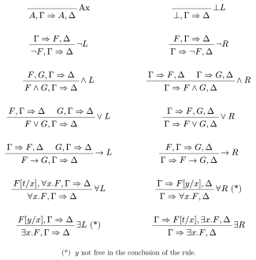

#+TITLE: seqc

A checker and prover for cut-free sequent-calculus proofs of
classical FOL.

* Build

#+begin_src sh
cargo build --release
#+end_src

The binary lands at ~target/release/seqc~.

* Usage

#+begin_src sh
seqc verify <proof-file>
seqc prove  [--latex|--typst] <formula-or-sequent>
seqc latex  <proof-file>
seqc typst  <proof-file>
#+end_src

~verify~ type-checks a proof tree from a file.  ~prove~ searches for
a proof of the given formula or sequent and prints it in the same
syntax (so it can be piped back through ~verify~).

~latex~ and ~typst~ re-render a proof file as a typeset proof tree
using the LaTeX [[https://ctan.org/pkg/bussproofs][~bussproofs~]] package or the Typst
[[https://typst.app/universe/package/curryst][~curryst~]] package respectively.  The same rendering is available
inline by passing ~--latex~ or ~--typst~ to ~prove~.

* Syntax

Identifiers are alphanumerics + ~_~ + ~'~, starting with a letter or
~_~.  Whitespace is ignored.

** Expressions (terms)

#+begin_example
t  ::=  x                       -- variable
     |  f(t1, ..., tn)          -- function application (n ≥ 0)
#+end_example

A bare identifier is read as a variable; an identifier immediately
followed by ~(...)~ is a function applied to comma-separated argument
terms.  A variable is bound if it lies under a quantifier with the
same name, otherwise it is free.

** Formulas

#+begin_example
F  ::=  ⊥  |  ⊤
     |  P  |  P(t1, ..., tn)    -- atomic predicate
     |  ¬F
     |  F ∧ F   |  F ∨ F  |  F → F
     |  ∀x. F   |  ∃x. F
#+end_example

Each connective has both an ASCII spelling and a Unicode glyph; either
form may be used (and mixed) freely:

| connective  | ASCII                 | Unicode |
|-------------+-----------------------+---------|
| bottom      | ~0~                     | ~⊥~       |
| top         | ~1~                     | ~⊤~       |
| negation    | =~​F=, ~!F~                | ~¬F~      |
| conjunction | ~F & G~, ~F and G~        | ~F ∧ G~   |
| disjunction | ~F|G~, ~F or G~         | ~F ∨ G~   |
| implication | ~F -> G~                | ~F → G~   |
| universal   | ~forall x. F~, ~all x. F~ | ~∀x. F~   |
| existential | ~exists x. F~           | ~∃x. F~   |

Precedence, tightest first: atoms / quantifiers / negation, ~∧~, ~∨~,
~→~.  ~∧~ and ~∨~ are left-associative; ~→~ is right-associative.

~⊤~ (~1~) is parsed as sugar for ~¬⊥~ — the calculus has no ⊤ rules of
its own, and it prints back as ~¬⊥~.

** Sequents and proof trees

A sequent is

#+begin_example
F1, ..., Fm => G1, ..., Gn          -- ASCII: =>
F1, ..., Fm ⇒ G1, ..., Gn           -- Unicode: ⇒
a, b, c : F1, ..., Fm => G1, ..., Gn -- with extra constants in scope
#+end_example

Either side of the arrow may be empty.  An optional ~a, b, c :~
prefix declares additional constants in scope for this sequent
(typically introduced by an outer ~existsL~ / ~forallR~); the colon is
omitted when there are none.

A proof tree is

#+begin_example
<sequent> by <rule>                              -- nullary (axiom, botL)
<sequent> by <rule> { <subproof> }               -- unary
<sequent> by <rule> { <subproof>, <subproof> }   -- binary
#+end_example

Rule keywords: ~axiom~, ~botL~, ~negL~, ~negR~, ~andL~, ~andR~,
~orL~, ~orR~, ~impL~, ~impR~, ~forallL~, ~forallR~, ~existsL~,
~existsR~.

* Rules

~Γ~, ~Δ~ are sets of formulas; ~t~ is any term; ~y~ is an
eigenvariable; ~F[t/x]~ is capture-avoiding substitution.

* Example

#+begin_src
=> A & B -> B & A by impR {
  A & B => B & A by andR {
    A & B => B by andL { A, B => B by axiom },
    A & B => A by andL { A, B => A by axiom }
  }
}
#+end_src

See ~proofs/valid/~ and ~proofs/bad/~ for more (~bad/~ proofs are
intentionally broken — e.g. ~bad/forall_right_captures_eigenvar.proof~
violates the freshness condition (∗)).
